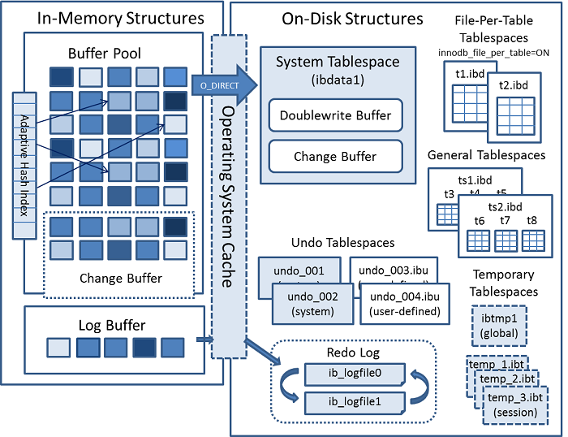

# DB INSERT에 고려할것들

## 1. 사건의 발단

부하테스트를 위한 mock 데이터 세팅을 하면서 50만건의 데이터를 INSERT했다. 한번에 50만건에 대해 INSERT를 하면 DB가 멈추거나 fail할 가능성이 있다.

실제로 50만건을 한번에 INSERT해보니 <mark style="color:red;">**커넥션 Timeout이 발생했다.**</mark>

***

## 2. INSERT 쪼개기 + 옵션값 수정으로 해결

데이터 스키마를 주고 GPT에게 SQL파일을 생성하라고 했더니 70mb정도의 거대한 SQL 파일을 받았다. 실제로 확인해보니 **50만건을 한번에 INSERT**하도록 작성해놓은 것을 확인했다. 새로운 요청을 했고 1000개씩 500개의 쿼리가 작성됐다. 하지만 실행직전 혹시 디비가 죽지않을까 고민하며 성능개선의 방법을 찾아봤다.


* **쿼리 쪼개서 여러번 실행하기**
* **Auto Commit 해제하고 실행하기**

두 방법을 적용했고 결과적으로 데이터를 INSERT하는데 성공했다.


**대량 INSERT할때 생각해볼 옵션들**

* Load로 데이터를 파일로 로드해 insert
* 큰 데이터를 나눠서 INSERT
* Foreign Key 제약조건 해제
* Auto Commit 해제

***

## 3. Load Data

`LOAD DATA` 명령은 내부적으로 **MySQL 엔진과 스토리지 엔진의 호출 횟수를 최소화하고 스토리지 엔진이 직접 데이터를 적재하기에 일반적인 INSERT보다 빠르다.**

RealMySQL에서는 단점도 소개한다.

* 단일 스레드로 실행
* 단일 트랜잭션으로 실행


데이터가 매우매우 커진다면 단일스레드, 단일 트랜잭션이 문제가 될 수도 있을 것 같다. 단일 스레드로 INSERT + INDEX UPDATE를 실행하는데 <mark style="color:red;">**전체 데이터의 크기에 비례해 소모시간이 커질 수 있다.**</mark>

하나의 트랜잭션은 UndoLog를 커밋할때까지 유지해야한다. 이는 디스크 WRITE 부하를 만든다. + <mark style="color:red;">**언두로그가 쌓이면 레코드를 읽는 쿼리들이 레코드를 찾는데 더 많은 오버헤드**</mark>가 사용된다.

**따라서 LOAD DATA를 위한 파일을 여러개로 준비해서 여러 트랜잭션에 나눠 실행하는 것이 바람직하다.**


**왜 오버헤드가 발생하는거지??**&#x20;


MySQL InnoDB 엔진은 MVCC를 위해 언두로그, 리두로그를 기록한다. 즉, 여러 스냅샷을 유지해서 트랜잭션의 격리 수준을 조절한다.

InnoDB의 아키텍처를 간단히 살펴보면 다음 그림과 같다.

<figure><figcaption><p>출처 : https://flashsql.github.io/innodb-doc-kr/images/innodb-architecture.png</p></figcaption></figure>

WRITE 요청이 들어오면 레코드의 이전 상태에 대한 언두로그가 생성된다. 따라서 Auto Commit = 0이나 **하나의 트랜잭션으로 대량의 데이터를 삽입하면&#x20;**<mark style="color:red;">**레코드의 수만큼 Undo로그가 쌓인다.**</mark>

트랜잭션 격리수준이 MySQL은 **REPEATABLE\_READ**인데, **해당 격리수준에서 읽기 쿼리가 수행되면 스냅샷인 UndoLog를 참조하여 읽기가 진행된다.** 따라서 데이터가 너무 많이 쌓이면 읽기 성능까지 영향을 주게된다.

***

## 4. Auto Commit

**MySQL의 Auto commit은 SQL 실행시 자동으로 COMMIT을 유발한다.**

```
SHOW VARIABLES LIKE 'autocommit';
SET autocommit = 0;       
```

MySQL 쿼리로 확인가능하다. **매 SQL마다 커밋을 하게되면 디스크 IO를 유발하기** 때문에 대량의 데이터 삽입시에 오버헤드가 발생할 수 있다.

## **+ Spring Transactional에서 Auto Commit**

Spring프레임워크를 사용하다보면 선언적으로 `@Transactional`을 사용한다. 해당 어노테이션이 붙은 메소드는 메소드의 종료시점에 COMMIT이나 ROLLBACK을 수행한다.&#x20;

가령, 3개의 쿼리가 하나의 트랜잭션으로 묶여서 Atomic하게 수행되야하는데 Auto Commit을 사용하면 매 SQL에 대해서 커밋이 발생하게 되어 **작업의 원자성이 깨진다.**

**따라서 선언적으로 스프링 트랜잭션 어노테이션을 사용하면 Auto-Commit을 false로 설정하고 작업을 수행한 후 한번에 Commit한다.**

```

@Transactional
public void doA() {
  // AUTO-COMMIT false 전환
	aRepository.save(...)
} // 종료 이후에 COMMIT

```

JDBC로 트랜잭션을 관리하는 매니저가 `springframework.jdbc.datasource.DataSourceTransactionManager.java` 클래스이다. 여기에서 메소드를 살펴보면

<figure><figcaption></figcaption></figure>

실제로 트랜잭션 시작 전에 false로 바꾼다. 이후 메소드가 종료되어 트랜잭션을 정리하는 메소드인 `doCleanupAfterCompletion`에서는 설정에 따라 다시 활성화한다.

<figure><figcaption></figcaption></figure>

***

**참고한 자료**


* https://tech.kakaopay.com/post/jpa-transactional-bri/\
  카카오페이 테크 블로그의 `Transactional`에 대한 글에도 트랜잭션과 관련된 정보를 얻을 수 있었다.
* [https://docs.spring.io/spring-framework/reference/data-access/transaction/declarative.html](https://docs.spring.io/spring-framework/reference/data-access/transaction/declarative.html)
* [https://junseokoh.tistory.com/68](https://junseokoh.tistory.com/68)

***
