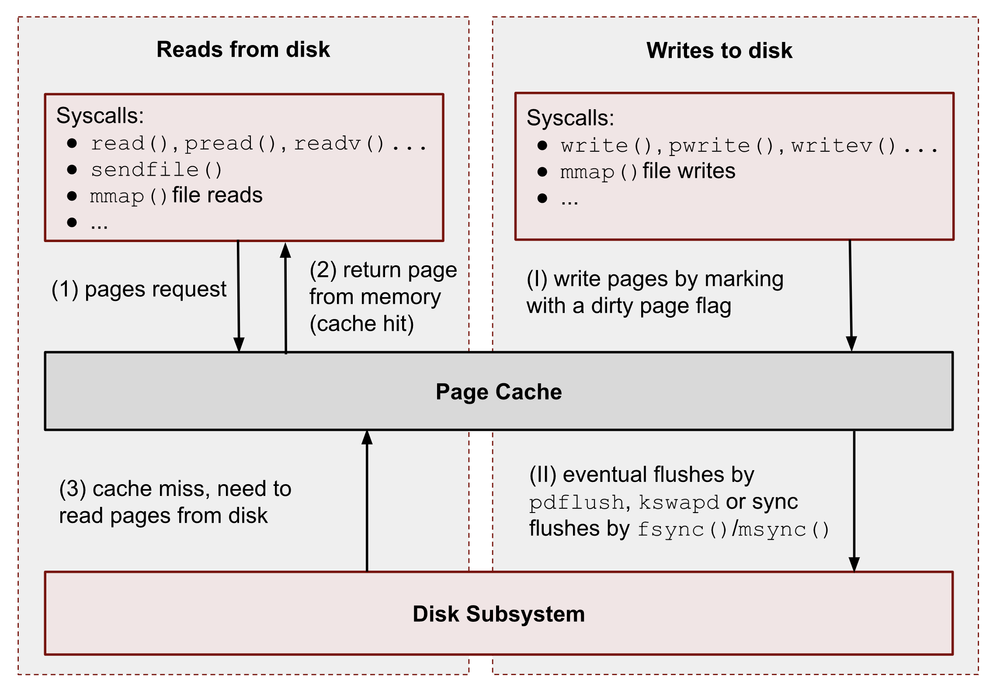

# Java NIO - Buffer

지금까지 프로그래밍에서 `Stream` 을 통한 I/O를 활용해오다가, 학교 수업시간에 NIO를 공부하게되어 개념을 정리하려한다.

* NIO?

NIO를 처음 마주한 것은 수업시간이 아닌 카프카였다.

카프카 공식문서를 확인하다가, 카프카는 JVM의 힙영역에 데이터를 저장하지 않고 운영체제의 페이지캐시에 직접 데이터를 저장하는 것을 확인했다. 소스코드를 다운로드받아 파티션 구현을 살펴보니 NIO의 ByteBuffer와 Channel을 사용하고 있었고 공부를 하게된 계기가 되었다.

#### 자바 NIO의 메모리 접근

* **Buffer?** 너 좀 익숙해

전공수업을 배우면서 버퍼라는 친구는 여러번 들어왔다. 시스템 프로그래밍, 운영체제에서 버퍼라는 친구를 제대로 사용하는 법을 배운다.

* 파일의 작은 부분을 여러번 수정하는 상황을 가정해보자.

다들 알다시피 파일에 대한 접근과 수정은 높은 오버헤드를 지닌다. 그런데 우리가 파일을 수정할때마다 IO를 즉각 반응하면 어떤일이 일어날까?

당연히 성능 저하가 발생한다. 실제메모리 영역에서는 멀리 떨어져있지 않은 공간에 대한 수정도 여러차례에 걸쳐서 발생하게 될 수 있다. **따라서 운영체제는 IO를 버퍼링하고 특정 시점에 한번에 반영한다.**

<figure><figcaption>
<a href="https://biriukov.dev/docs/page-cache/2-essential-page-cache-theory/">https://biriukov.dev/docs/page-cache/2-essential-page-cache-theory/</a>
</figcaption></figure>

* **그런데 여기 NIO에서 버퍼는 뭘까?**

Buffer 클래스는 말그대로 고정된 길이의 데이터를 저장하는 컨테이너이다. 자바의 각 원시 자료형에 대해서 버퍼가 하나씩 구현되어 있다. **그런데 NIO의 버퍼는 커널에 의해 관리되는 시스템 메모리를 직접 사용할 수 있다.**

Java에서는 `ByteBuffer`을 통해 네이티브 영역의 메모리를 사용하는 `DirectBuffer`을 만든다.

> 마치 C / C++의 포인터를 연상하게한다.

* **시스템의 메모리에 읽고 쓰기는 채널!**

Buffer클래스는 Channel과 한 쌍으로 작동하게되는데, Channel은 I/O를 전달하는 포탈(차원문)이고 버퍼는 데이터를 가져오는 Source 또는 Destination이다.

채널은 기본 IO을 담당했던 Stream에 가까운 친구로 단방향, 양방향 통신이 모두 가능하다. 우리는 채널을 통해 시스템 메모리인 버퍼에 직접 데이터를 읽고 쓸 수 있다! !\[\[Screenshot 2024-11-11 at 6.16.29 PM.png]]

* **ByteBuffer**

특이한 점은 Channel은 `ByteBuffer` 만을 인자로 받는다.

운영체제는 메모리공간을 Sequential한 바이트공간으로 인식한다. 따라서 자바의 원시형 타입 버퍼가 아닌 ByteBuffer을 `Direct Buffer`에 사용한다.

자바는 일반적인 버퍼와 다른 `Direct Buffer`을 만들었다. 이 Direct Byte Buffer을 통해 네이티브 메모리공간에 효율적으로 작업할 수 있다.

* Nondirect Buffer도 물론 인자로 받을 수 있지만 성능이 나빠진다. (내부적으로 Direct Buffer을 만들어 Copy하는 방식으로 작동한다.)

#### 생각해볼것

***

* **NIO의 Buffer은 Thread-safe하지 않다.** C언어로 시스템프로그래밍을 배울때 상호배재를 이뤄내기위해 우리는 뮤텍스와 같은 동시성 3대장 친구들을 사용했다.

자바에서도 동일하게 `Buffer` 객체에 대한 락을 획득하여 임계영역에 접근하면 해결할 수 있다.

* **There is no silver bullet**

Direct Buffer은 IO 최적화를 이뤄내지만 그만큼 생성비용이 크다. Direct Buffer를 사용하여 커널영역의 메모리에 저장했지만 쓰고 지우기가 반복되며 파편화 되면 오히려 운영체제, JVM에 따라 나쁜 성능을 보일 수 있다.

또한 **GC 영역이 아니라는 점**은 개발자가 직접 이들을 관리해야함을 시사한다.
